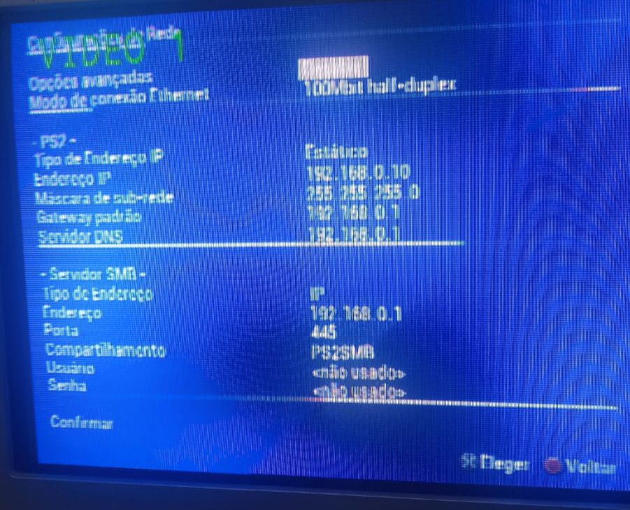

# 🎮 PS2 OPL + SMB (Linux) — Rodando jogos via rede

## 📌 Overview

Este projeto mostra como configurar um servidor SMB em Linux para rodar jogos de PS2 via rede usando o OPL (Open PS2 Loader).

O foco não é apenas a configuração, mas também **resolver problemas reais** como erros de conexão (300/310), permissões e compatibilidade.

---

## 🧠 Arquitetura

```
PS2(OLP) → Ethernet → PC (Linux) → Samba(SMB1) → Jogos (.ISO)
```

---

## ⚙️ Requisitos

- PS2 com OPL
- Adaptador de rede (PS2 FAT ou Slim compatível)
- PC com Linux (Ubuntu/Debian)
- Cabo de rede
- Jogos em formato `.ISO`

---

## 📂 Estrutura de pastas

```
/home/user/ps2smb/
 ├── DVD/
 ├── CD/
 └── POPS/   (opcional para PS1)
```

---

## 🛠️ Configuração do Samba

Instale o Samba:

```bash
sudo apt install samba
```

### Configuração mínima funcional:

Edite o arquivo:(se você não usa o compartilhamento de arquivos via SMB para outras aplicações pode apagar o arquivo inteiro, caso use e queira fazer um teste ou algo parecido, faça o backup do arquivo smb.conf)

```bash
sudo nano /etc/samba/smb.conf
```

```bash
[global]
workgroup = WORKGROUP
server min protocol = NT1 #SMB1 é necessario pois o PS@ não suporta SMB2 ou Superior
map to guest = Bad User 

[PS2SMB]
path = /home/<USER>/ps2smb
browseable = yes
read only = no
guest ok = yes
force user = Your_User # Evita erro 310
```

### Configuração focada em performace:

https://github.com/ra1nst0rm3d/smb-config/blob/main/smb4.conf (Creditos ao ra1nst0rmed)

Reinicie o serviço:

```bash
sudo systemctl restart smbd
```

---

## 🌐 Configuração de rede

### PC (Linux)

Use o comando abaixo para verificar o nome das interfaces de rede do seu computador:

```bash
ip a
```

Uma vez identificada, utilize-a nos comandos abaixo para colocar o IP fixo na interface:

```bash
sudo ip addr add 192.168.0.1/24 dev "Sua Interface"
sudo ip link set "Sua Interface" up
```

---

### PS2 (OPL)

Configuração manual:

| Campo | Valor |
| --- | --- |
| PS2 IP | 192.168.0.10 |
| Mask | 255.255.255.0 |
| Gateway | 192.168.0.1 |
| SMB Server IP | 192.168.0.1 |
| Share Name | PS2SMB |

⚠️ Use **IP**, não NetBIOS.(Netbios era usado no contexto em que um computador era identificado pelo seu nome, no nosso contexto, configuramos o ip fixo então não é necessario usar desta maneira)

---

## Configuração OPL no PS2



---

## 🧪 Testes

Verificar se o SMB está funcionando:

```bash
smbclient -L localhost -N #Lista os diretorios que estão sendo compartilhados via SMB na maquina
```

Testar acesso direto:

```bash
smbclient //localhost/PS2SMB -N #tenta conexão direta utilizando o protocolo
```

---

## ❗ Troubleshooting (importante)

### 🔴 Erro 300 — Não conecta ao servidor

Causas:

- IP incorreto
- PS2 não está na mesma rede
- cabo desconectado

Solução:

- revisar IP
- testar conexão física
- evitar Wi-Fi

---

### 🟡 Erro 310 — Acesso negado

Causas:

- permissões da pasta
- configuração de usuário no Samba

Solução:

```bash
chmod -R 777 /home/user/ps2smb
```

E garantir:

```
force user = user
```

---

### ⚠️ Jogos não aparecem

- nome do share incorreto
- pasta errada

---

## 🚀 Melhorias

- Configurar IP fixo permanente: Fique atento a questão dos IPs do PS2 e do Computador com Linux, de preferencia coloque o IP de ambos estaticos e na mesma rede.(para as configurações de rede ficarem permanentes no linux altere o arquivo netplan)
- Otimizar performance do Samba Ref: https://github.com/ra1nst0rm3d/smb-config/blob/main/smb4.conf (Creditos ao ra1nst0rmed)

---

## 💡 Lições aprendidas

- SMB1 é obrigatório para PS2
- NetBIOS raramente funciona
- permissões são a principal causa de erro
- cabo é mais estável que Wi-Fi

---

## 📎 Observação

Este projeto não inclui jogos ou links para download.

O foco é exclusivamente na configuração da infraestrutura.

---
